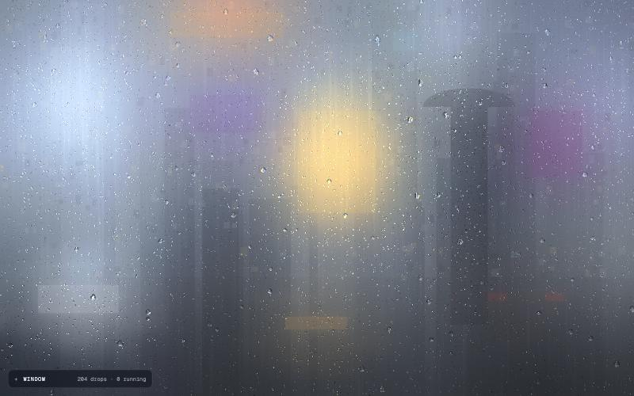
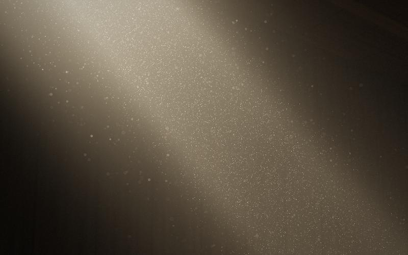

# Phenomenon

Interactive animations of natural phenomena, each one a single self-contained web page built
with WebGL 2. No frameworks, no dependencies: open the file and it runs.

By **Hiro · Akatori Design** · © 2026

---

## Rain on Glass



Rain running down a fogged window. Drops land, merge, drip and refract the street behind the
glass; above 80% rainfall, streams run down the pane. Sound follows the rain, with the odd
roll of thunder in a storm.

- **Drag** across the glass to wipe it, as if with three fingers.
- **Drop a photo or video** anywhere to look through the glass at it.
- **The Window tray** sets rainfall, drop size, condensation, refraction, fog and humidity.

[Source page](rain-on-glass/index.html) · [Installable package](packages/rain-on-glass/)

## Attic Light



Sunlight through a gap in an attic roof. Hundreds of thousands of dust specks drift in moving
air, glowing where the beam catches them and falling dark in shadow.

- **Move the pointer** to stir the air.
- **Press and drag** to swing a hand through the beam and sweep the dust away. It drifts back
  in over about a minute.

[Source page](attic-light/index.html) · [How it works](attic-light/README.md)

---

## Running a project

Each project is a folder with an `index.html`. Open it in a current version of Chrome, Safari,
Firefox or Edge, or serve the repo locally:

```bash
python3 -m http.server 8000
```

Then visit `http://localhost:8000/<project-folder>/`.

## Packages

Projects can also ship as private, installable web components on GitHub Packages. Only the
minified build, the licence and a README are published.

| Package | Element | Source page |
| --- | --- | --- |
| [`@akatori-design/rain-on-glass`](packages/rain-on-glass/) | `<rain-on-glass>` | [rain-on-glass/index.html](rain-on-glass/index.html) |

Each package is generated from its project's `index.html`, so keep editing the page, then rebuild:

```bash
cd packages/<project-folder>
npm install
npm run build
```

Open `packages/<project-folder>/demo.html` through the local server above to check the element.
`npm pack --dry-run` shows exactly which files would be published. Install and usage steps for
people using a package are in that package's own README.

Every package is signed **Hiro · Akatori Design** in four places: a copyright notice at the top
of the built file, a credits comment inside the element, a `credits` property, and a credit line
in the control tray.

### Adding a package for another project

1. In the project's `index.html`, route every `window` and `document` access through a
   `// ---------- host ----------` block at the top of the script, as `rain-on-glass` does.
2. Copy `packages/rain-on-glass/` to `packages/<project-folder>/` and adapt `build.mjs`, the
   element's attributes, `package.json`, `LICENSE`, `README.md` and `demo.html`.
3. Build, check the demo, and run `npm pack --dry-run` before publishing with `npm publish`.
   Publishing needs a GitHub token with the `write:packages` scope.

## Copyright

© 2026 Hiro · Akatori Design. All rights reserved.

The source is shared here to be viewed. No licence is granted to copy, modify or redistribute
it. Each package carries its own licence; see the package's `LICENSE`.
